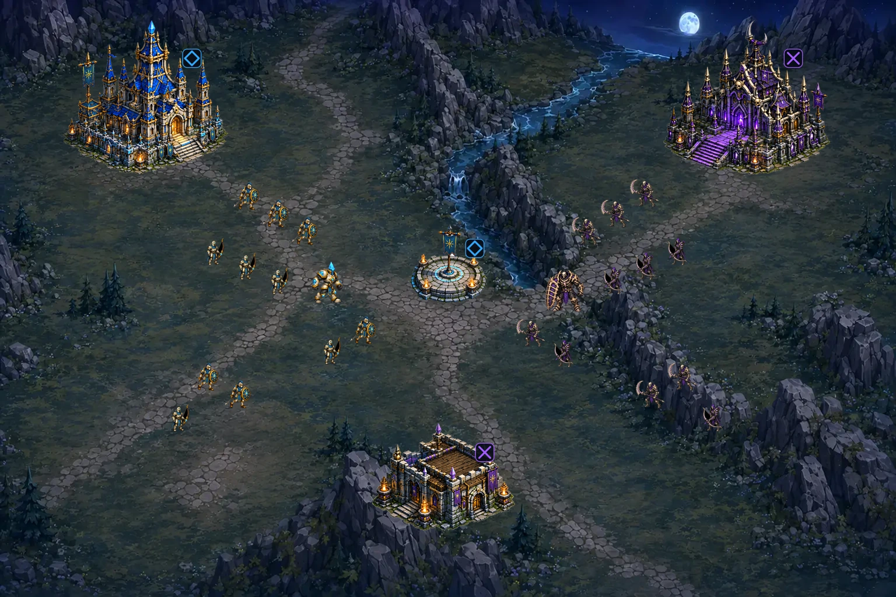

<div align="center">

# Aeon of Kingdoms

**An original landscape real-time strategy game, being rebuilt one approved phase at a time.**

[](CHANGELOG.md)
[](https://github.com/XenoVoyage/Aeon-of-Kingdoms/actions/workflows/ci.yml)
[](https://github.com/XenoVoyage/Aeon-of-Kingdoms/actions/workflows/pages.yml)
[](LICENSE)

> **Active redesign:** the product owner rejected the `v2026.8.15` prototype and approved the phased replacement plan. Its UI, art, map, controls, terminology, gameplay feel, and AI are not the baseline for future work.

## Phase 2 landscape battlefield foundation — active

[Open the Phase 2 source candidate](phase2/) · [Review the approved Phase 1B target](https://xenovoyage.github.io/Aeon-of-Kingdoms/concepts/phase1b/) · [Read the exact Phase 2 contract](docs/PHASE2_FOUNDATION.md)

</div>

[](concepts/feasibility/phase1a/review/battlefield-desktop.webp)

The owner approved the production method in [`docs/PRODUCTION_ART.md`](docs/PRODUCTION_ART.md): cartoon-leaning baked full-body sprites, canonical right-facing art with an exact X-mirrored left facing, one stable idle frame, four movement frames with invariant upper bodies and equipment, six-frame action and defeat sequences, and separate player-color masks for every player-controlled entity and ownable structure. On 2026-08-21 the owner approved the corrected Aegis Titan and complete Phase 1A package, then explicitly approved the complete Phase 1B menu/HUD, battlefield, twelve-identity language, landscape controls, viewport policy, and measured runtime-art envelope. The four derived Astral Guardian browser samples were subsequently corrected from the intact approved master after three movement cells were found to be missing their lower-body pixels.

Phase 2 is now authorized and active. Its verified-source candidate is limited to the approved menu, landscape/portrait gate, bounded focus-centred camera, one two-player six-layer map, environment-only terrain, blockers, anchors, and navigation debug presentation. It contains no combat entities, movement simulation, economy, production, combat, AI, or networking. Source automation has passed; rendered, deployed, physical-device, and explicit owner-gate evidence remain separate. The image above is a non-gameplay composition built from separate assets; it remains Phase 1A review evidence rather than a Phase 2 screenshot. [`docs/STATUS.md`](docs/STATUS.md) owns the exact current source, deployment, evidence, and next-boundary state. The rejected prototype remains available at commit [`7f88655`](https://github.com/XenoVoyage/Aeon-of-Kingdoms/commit/7f88655f10504f44496fbba2e17871b16a5fe115) in Git history; its misleading `v2026.8.15` tag and GitHub Release were retired without rewriting history, and that label must not be reused.

## Replacement target

The first replacement release remains one original layered landscape battlefield, two factions, faction-specific headquarters, shared Resource Points and Production Outposts, production and rally commands, readable formation combat, and strategic AI. The local simulation is proved before multiplayer. The [approved Phase 1B review](concepts/phase1b/) defines the visual and interaction target. The active [Phase 2 foundation](docs/PHASE2_FOUNDATION.md) must pass its own empty-battlefield and camera-feel gate before Phase 3 entity or movement work begins.

## Preview the transition page locally

Open `index.html` in a modern browser for project status, `phase2/index.html` for the active landscape-foundation candidate, `concepts/phase1b/index.html` for the approved script-free target, or the files under `concepts/feasibility/phase1a/` for approved masters. Node.js 20 or newer is used for the dependency-free source verification suite:

```sh
node tests/run.js
```

## Project documentation

- [Active redesign roadmap](docs/REDESIGN.md)
- [Phase 1A closure handoff](docs/PHASE1A_HANDOFF.md)
- [Approved Phase 1B visual and interaction lock](docs/PHASE1B_VISUAL_LOCK.md)
- [Active Phase 2 landscape foundation](docs/PHASE2_FOUNDATION.md)
- [Approved production-art contract](docs/PRODUCTION_ART.md)
- [Current status](docs/STATUS.md)
- [Prototype-era game design](docs/GAME_DESIGN.md)
- [Prototype-era architecture](docs/ARCHITECTURE.md)
- [Multiplayer and netcode plan](docs/NETCODE.md)
- [Asset and visual-feasibility record](docs/ASSETS.md)
- [Contributing](CONTRIBUTING.md) and [security](SECURITY.md)

Directed and reviewed by **XenoVoyage**, with implementation support from **OpenAI Codex**. Released under the [MIT License](LICENSE).
