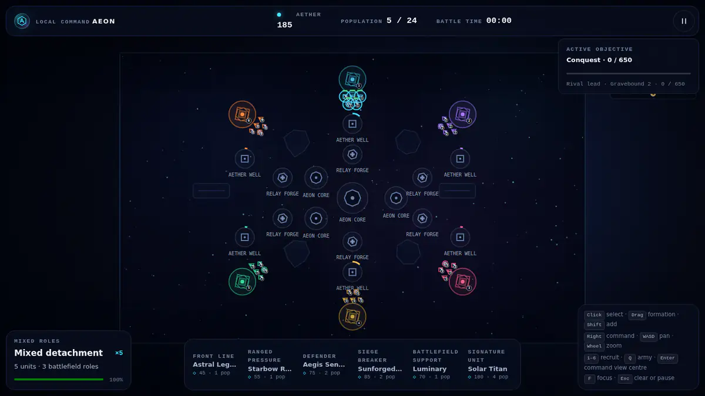

<div align="center">

# Aeon of Kingdoms

**A compact real-time strategy game where every captured point reshapes the war.**

[](CHANGELOG.md)
[](https://github.com/XenoVoyage/Aeon-of-Kingdoms/actions/workflows/ci.yml)
[](https://github.com/XenoVoyage/Aeon-of-Kingdoms/actions/workflows/pages.yml)
[](LICENSE)

## [Play Aeon of Kingdoms](https://xenovoyage.github.io/Aeon-of-Kingdoms/)

</div>



Aeon of Kingdoms is an initial playable RTS vertical slice for desktop and touch devices. Command the Astral Concord or Gravebound Court, claim Aether Wells and forward Relay Forges, respect the population limit, and destroy the enemy Nexus.

## At a glance

| Detail | Current slice |
| --- | --- |
| Play | One skirmish and one campaign scenario against deterministic AI |
| Factions | Astral Concord and Gravebound Court, each with six faction-named roles |
| Battlefield | Aeon Convergence, with mirrored 2-, 4-, and 6-faction seats and distance-matched opening sites; balance remains pending |
| Runtime | Local HTML, CSS, JavaScript, and Canvas; no build step or runtime dependency |
| Multiplayer | Protocol and transport architecture documented; not shipped in this build |

## Command

- Select units with pointer or touch, then issue a move or attack order on the battlefield.
- Capture Aether Wells and Relay Forges to grow map control without base-building.
- Recruit within the shared population cap; positioning and composition matter more than unit spam.
- Eliminate opposing headquarters in every mode, or complete the selected Conquest, King of the Hill, or Domination objective first.

## Run locally

Clone or download the repository and open `index.html` in a modern browser. No installation is required. Node.js 20 or newer is used only for the dependency-free verification suite:

```sh
node tests/run.js
```

## Project documentation

- [Game design](docs/GAME_DESIGN.md)
- [Architecture](docs/ARCHITECTURE.md)
- [Multiplayer and netcode plan](docs/NETCODE.md)
- [Current status](docs/STATUS.md)
- [Asset and art direction](docs/ASSETS.md)
- [Contributing](CONTRIBUTING.md) and [security](SECURITY.md)

Designed and implemented with **OpenAI Codex**, with gameplay direction and review from **XenoVoyage**. Released under the [MIT License](LICENSE).
