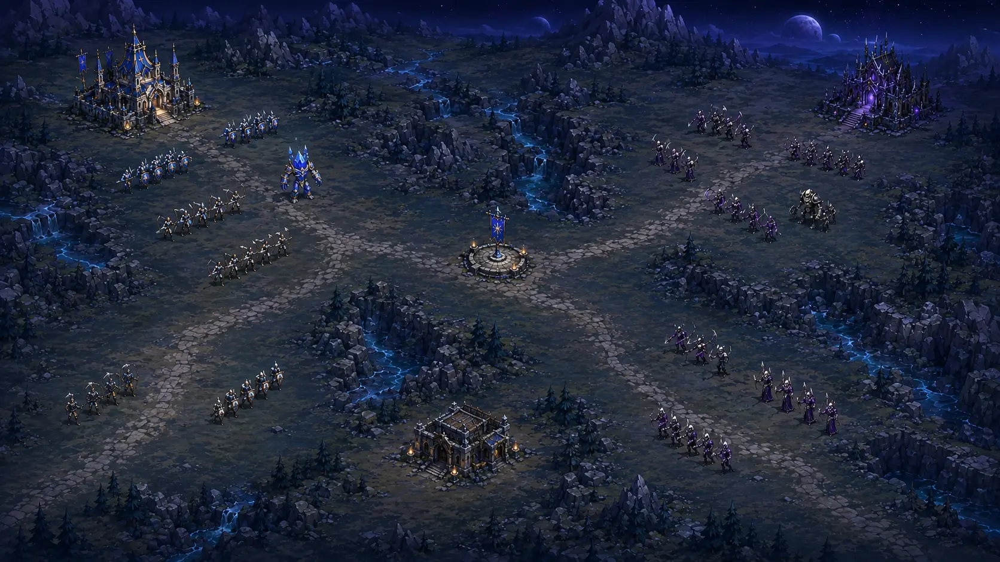

<div align="center">

# Aeon of Kingdoms

**An original landscape real-time strategy game, being rebuilt one approved phase at a time.**

[](CHANGELOG.md)
[](https://github.com/XenoVoyage/Aeon-of-Kingdoms/actions/workflows/ci.yml)
[](https://github.com/XenoVoyage/Aeon-of-Kingdoms/actions/workflows/pages.yml)
[](LICENSE)

> **Active redesign:** the product owner rejected the `v2026.8.15` prototype and approved the phased replacement plan. Its UI, art, map, controls, terminology, gameplay feel, and AI are not the baseline for future work.

## [Review the Phase 1A production-feasibility proof](https://xenovoyage.github.io/Aeon-of-Kingdoms/concepts/feasibility/)

[View the current redesign status](https://xenovoyage.github.io/Aeon-of-Kingdoms/) · [Compare the mood-reference archive](https://xenovoyage.github.io/Aeon-of-Kingdoms/concepts/)

</div>

[](concepts/feasibility/)

The deployed `v2026.8.20a` review build adds a separate, explicitly unapproved Phase 1A proof at practical RTS scale: one crowded battlefield, two three-role faction lineups, the exact three structure categories, a six-layer map diagram, and a four-family animation pose board. The painting above is a visual target, not an in-game screenshot. Its frozen source passes 68/68 integrated checks and the exact 24-file Pages stage; the live status entry, proof entry, proof stylesheet, and all six proof images match merged source byte for byte. Publication is complete, but owner review remains separate. No redesigned gameplay, final art lock, physical-device proof, tag, or GitHub Release is claimed. The rejected prototype remains available through the published [historical release `v2026.8.15`](https://github.com/XenoVoyage/Aeon-of-Kingdoms/releases/tag/v2026.8.15), its tag and Git history.

## At a glance

| Detail | Current truth |
| --- | --- |
| Public Pages payload | `v2026.8.20a` non-playable status, mood archive, and Phase 1A proof at merge commit `75ec47c`; untagged and not a GitHub Release |
| Current source | Deployed, source-verified Phase 1A review build; the visual method remains owner-unapproved |
| Active work | Review the Phase 1A production method; redesigned gameplay has not started |
| Replacement target | One original layered map, two factions, landscape camera play, unique headquarters, shared Resource Points and Production Outposts, production/rally, readable combat, and strategic AI |
| Replacement runtime principle | Local HTML, CSS, JavaScript, and Canvas unless an approved phase proves another need |
| Multiplayer | Later phase after the redesigned local simulation is approved; not shipped |

## Preview the transition page locally

Open `index.html` in a modern browser. It intentionally provides redesign status and documentation links only. Node.js 20 or newer is used for the dependency-free source verification suite:

```sh
node tests/run.js
```

## Project documentation

- [Active redesign roadmap](docs/REDESIGN.md)
- [Current status](docs/STATUS.md)
- [Prototype-era game design](docs/GAME_DESIGN.md)
- [Prototype-era architecture](docs/ARCHITECTURE.md)
- [Multiplayer and netcode plan](docs/NETCODE.md)
- [Asset and visual-feasibility record](docs/ASSETS.md)
- [Contributing](CONTRIBUTING.md) and [security](SECURITY.md)

Directed and reviewed by **XenoVoyage**, with implementation support from **OpenAI Codex**. Released under the [MIT License](LICENSE).
