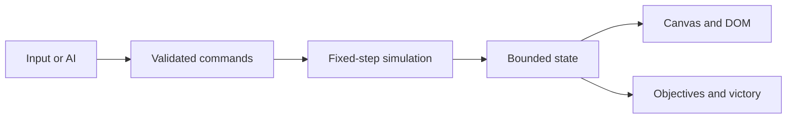

# Architecture

> **Prototype-era document:** everything below describes the rejected `v2026.8.15` runtime as frozen historical evidence. Prescriptive language records what that prototype did; it is not an instruction to preserve source names, ownership, data shapes, tuning, or behavior. [`REDESIGN.md`](REDESIGN.md) owns the replacement phases, [`PHASE2_FOUNDATION.md`](PHASE2_FOUNDATION.md) owns the approved landscape shell/camera/map/renderer, [`PHASE3_ENTITY_MOVEMENT.md`](PHASE3_ENTITY_MOVEMENT.md) owns the approved first replacement simulation foundation, and [`PHASE4_STRUCTURES_ECONOMY.md`](PHASE4_STRUCTURES_ECONOMY.md) owns the current structures/economy/production/rally candidate. This historical architecture is not a source for replacement implementation values.

Aeon of Kingdoms is a static browser game: semantic HTML, responsive CSS, classic JavaScript, and a Canvas battlefield. The playable client has no build step or runtime package dependency and works both from `file://` and from the GitHub Pages repository subpath.

This document records the prototype runtime boundaries and data flow. Current redesign truth belongs in [`REDESIGN.md`](REDESIGN.md) and [`STATUS.md`](STATUS.md).

## Runtime flow

`index.html` loads the runtime in dependency order:

1. `js/config.js` — immutable tuning, rosters, map data, and enforced limits.
2. `js/core.js` — deterministic math, random generation, geometry, and reusable collections.
3. `js/simulation.js` — authoritative state transitions, orders, capture, recruitment, combat, and victory.
4. `js/ai.js` — deterministic computer-player intent using the same command boundary as a human.
5. `js/render.js` — Canvas world presentation and non-authoritative visual interpolation.
6. `js/input.js` — pointer, touch, keyboard, selection, and order intent.
7. `js/game.js` — mode setup, UI projection, frame scheduling, pause, and lifecycle coordination.

Browser events produce intent. The simulation consumes accepted commands on fixed ticks, produces bounded state, and never reads visual interpolation back from the renderer.

## Prototype source inventory

| Source | Owns | Must not own |
| --- | --- | --- |
| `index.html` | Semantic shell, accessible controls, CSP, runtime order | Balance or combat decisions |
| `css/tokens.css` | Palette, spacing, typography, motion, and shared design tokens | Component layout |
| `css/app.css` | Responsive shell, HUD, dialogs, touch layout, state presentation | Simulation truth |
| `js/config.js` | Factions, unit/site definitions, tuning, fixed limits, map description | Mutable battle state |
| `js/core.js` | Pure deterministic utilities and spatial/path primitives | DOM or game-mode orchestration |
| `js/simulation.js` | Battle state and authoritative rules | Browser event binding or drawing |
| `js/ai.js` | Computer command selection | Privileged state mutation |
| `js/render.js` | Procedural art, camera projection, interpolation, effects | Rule outcomes or authoritative randomness |
| `js/input.js` | Device events and player intent | Direct state mutation |
| `js/game.js` | Startup, modes, frame loop, UI projection, lifecycle | Duplicate balance tables |
| `tests/` | Deterministic and delivery contracts | Human balance or art acceptance |

Prototype maintenance belonged in these owners. An approved redesign phase may replace the files or boundaries; any replacement must still keep responsibilities direct and interfaces small.

## Determinism and time

- Simulation advances at 20 Hz (`TICK_MS = 50`) and the frame loop limits delayed-frame catch-up to five ticks.
- Commands are applied in a stable tick and player sequence.
- Random decisions use seeded project utilities, never ambient `Math.random()` inside authoritative rules.
- State calculations use integer or deliberately quantized values where floating-point drift could affect a rule boundary.
- Rendering may interpolate or omit effects, but it cannot advance combat.
- Pause and page lifecycle transitions neutralize held input before play resumes.

The same rules are prerequisites for reproducible tests, campaign scripting, replays, and the planned host-authoritative command stream.

## Bounded work

Every collection and search requires a configured ceiling and deterministic cleanup. Population begins at 24, grows through captured sites, and is capped at 48 per player; the complete battlefield is capped at 240 units. Particles, floating labels, queued commands, path searches, cached routes, and AI candidates also need technical caps. A frame delay must not trigger unlimited catch-up.

Hot update paths should avoid per-unit temporary arrays where a reused buffer or spatial bucket suffices. Spatial queries inspect nearby buckets, not the entire army, when unit count makes a full scan material. Optimize observed hot paths without adding a framework or speculative abstraction layer.

## Navigation and formations

Movement separates group strategy from local presentation:

- A deterministic eight-neighbor A* grid uses 40-unit cells, prevents diagonal corner cutting, smooths by line of sight, and caps returned paths.
- Rotated formation slots produce stable per-unit destinations based on unit identity and footprint.
- A 56-unit spatial hash bounds two-pass local separation work.
- Attackers receive stable per-target ring positions rather than sharing the target centre.
- Large units use stronger hard separation and larger static-obstacle/path clearance.

The simulation owns final positions. The renderer can smooth between them but cannot resolve collisions visually. See [`GAME_DESIGN.md`](GAME_DESIGN.md) for the intended anti-stacking behavior; [`STATUS.md`](STATUS.md) identifies which layers the current slice has verified.

## Commands and modes

A command is a small data record: issuing player, sequence, target tick, command kind, selected unit identifiers, and a validated position or entity identifier. Human input, AI, campaign scripting, replay, and future remote clients should enter through this boundary.

Modes compose victory objectives around the shared battle state. They do not fork movement, economy, recruitment, damage, capture, or elimination rules. Headquarters elimination is evaluated regardless of the additional objective in play.

## Browser and hosting boundaries

- Runtime resources are local, relative paths; no root-relative link may assume domain-root hosting.
- GitHub Pages serves immutable static client files only. It does not run a relay, authoritative server, database, or matchmaking process.
- GitHub Actions verifies the complete source, stages only the explicit runtime allowlist into `_site`, and deploys that artifact unchanged.
- Network access remains disabled by the current client policy until a reviewed multiplayer adapter and matching CSP boundary are implemented.
- Fullscreen, orientation lock, pointer capture, audio, and storage may be unavailable; capability failures must leave a playable safe path.

## Installable shell

`manifest.webmanifest` describes the repository-scoped installable experience. `sw.js` registers only on HTTP(S), pre-caches the same explicit local shell deployed by Pages, deletes earlier project-owned shell caches, and intercepts only exact same-origin allowlisted URLs. Direct-file play does not depend on service workers. The service worker never invents an API, multiplayer relay, or background authority; offline readiness after a first served load remains a browser capability that needs rendered verification.

## Accessibility

The Canvas is not the only source of status. Essential resources, population, objective progress, selection summary, pause state, and outcome are projected into semantic DOM. Controls remain keyboard reachable; dialogs own focus; visible focus is preserved; touch targets remain usable in compact landscape; color is never the only faction or state signal; and reduced-motion preferences affect presentation only.

## Version and publication

`VERSION.txt` is the canonical runtime label. README and changelog text are audited mirrors. Changing documentation alone does not create a runtime release; tags, GitHub Releases, deployments, and observed live play are separate evidence.

The Pages staging script is `.github/scripts/stage-pages.js`. Its allowlist is intentionally explicit so documentation, tests, repository metadata, and future server code cannot be published accidentally.
